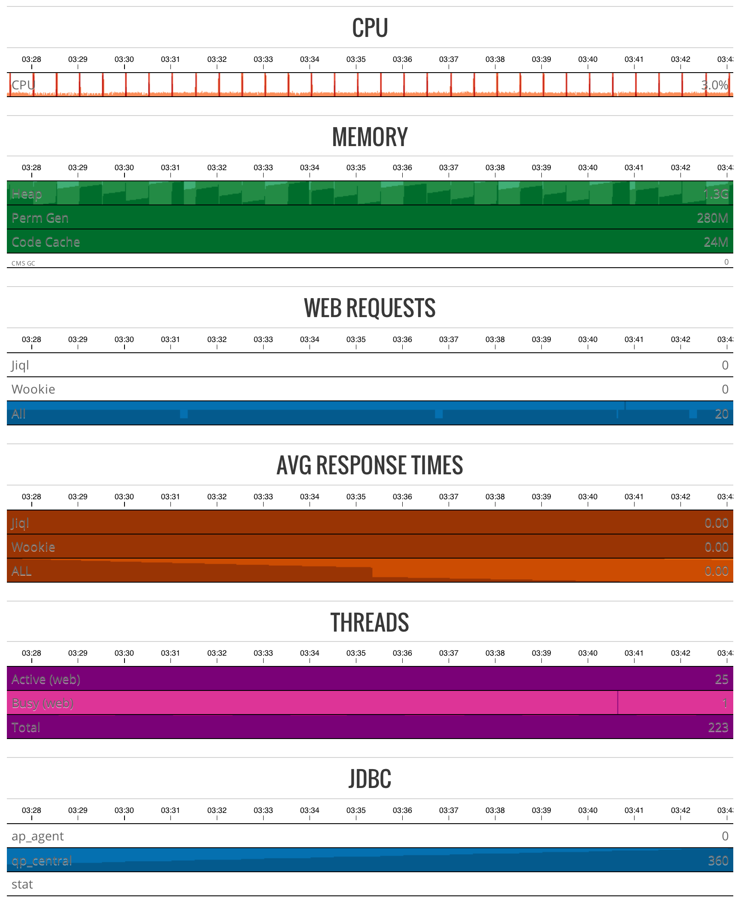

#orchestra-perfmon-r5#
##Description##
Orchestra R5 performance monitor app, displays JMX data via a dashboard.

Uses [jolokia](http://www.jolokia.org/) and [cubsim](http://square.github.io/cubism/), wich is a [D3](http://d3js.org) plugin.

##Requirements##
* Qmatic Orchestra release 5

##Building##
* Clone repository
* Run `gradlew clean build`

##Using##
Copy `build/libs/perfmon.war` to Orchestra `/custdeploy` directory.

You will need to enable Glassfish monitring service components to see all the required metrics.
Login to Glassfish admin console, goto `Configurations -> server-config -> Monitoring` set the following services to `HIGH` then save:

* Web Container
* Thread Pool
* JVM
* JDBC Connection Pool
* HTTP Service

By default the dashboard displays metrics with a 1 second step interval, to increase the step  
and display a longer time frame edit the [cubism](http://square.github.io/cubism/) context in `js/monitor.js`:

	var context = cubism.context()
		.serverDelay(0)
		.clientDelay(0)
		.step(1 * 1000) // every 1 seconds
		.size(940);
